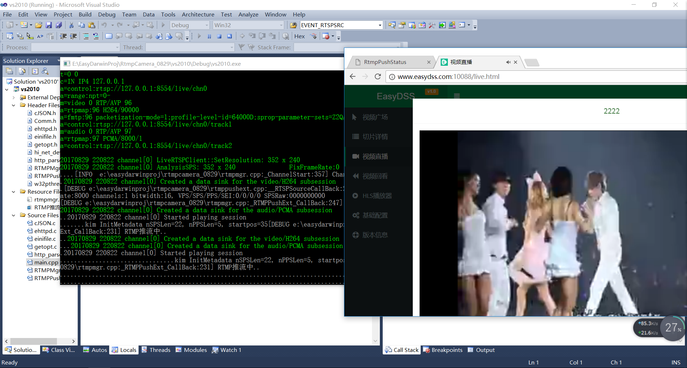

#RTMP推流摄像头设计实现4 - 控制与状态管理

##概要
这个模块就是整合前几个模块，来实现推流的控制，监视等。
使用RTMPPushExt实现取流、转码、推流等媒体流任务。
使用http服务模块实现配置接口，http+json。
使用配置文件模块实现配置信息的保存与读取。

##程序接口定义
- 设备流启停通知回调
    typedef struct
    {
        Easy_I32 (*StartStream)(Easy_U32 channelID, EASY_MEDIA_INFO_T* mediaInfo, void* _user_data);
        void (*StopStream)(Easy_U32 channelID, void* _user_data);
    } RTMPMgr_Callback;

- 创建与销毁通道管理器
    RTMPMgr_Handle RTMPMgr_Start(const char* config, RTMPMgr_Callback cb, void* _user_data);
    void RTMPMgr_Stop(RTMPMgr_Handle handle);

- 设备流推流接口
    Easy_I32 RTMPMgr_PushVideo(RTMPMgr_Handle handle, Easy_U32 channelID, const Easy_U8* frame, Easy_U32 size, Easy_U32 ts_ms);
    Easy_I32 RTMPMgr_PushAudio(RTMPMgr_Handle handle, Easy_U32 channelID, const Easy_U8* frame, Easy_U32 size, Easy_U32 ts_ms);

##HTTP配置接口定义
- 获取推流通道配置及状态
请求:
	GET /get_config HTTP/1.1
回复:
	Content-Type: applicantion/json
	{
		"data" : {
			"status" : "Disabled|ConfigErr|RtmpConnecting|Success",
			"enable" : true|false,
			"source" : "device|rtsp",
			"rtsp_url" : "rtsp://xxxx",
			"rtmp_url" : "rtmp://xxxx"
		},
		"code" : 0,
		"msg" : "成功"
	}

- 配置推流通道
请求:
	POST /set_config HTTP/1.1
	Content-Type: applicantion/json
	{
		"enable" : true|false,
		"source" : "device|rtsp",
		"rtsp_url" : "rtsp://xxxx",
		"rtmp_url" : "rtmp://xxxx"
	}
不改变的配置项可以不填
回复:
	Content-Type: applicantion/json
	{
		"code" : 0,
		"msg" : "成功"
	}

- 一个简单的通道html状态反馈
浏览器地址:
    http://localhost:8000
回复:
    <html>
	<head><title>RtmpPushStatus</title></head>
	<body>
	
RTMP推流状态

    Channel%u attr:%s status:%s source:%s url:%s  
    </body>
    </html>

##配置文件接口
[Base]
EasyRTMP_License=
EasyAACEncoder_License=
EasyRTSPClient_License=
HttpSrvPort=8000
BaseChannelNum=1

[Channel_0]
Enable=true
IsRtspSrc=false
RtspUrl=rtsp://127.0.0.1:8554/live/chn0
RtmpUrl=rtmp://www.easydss.com:10085/live/0000

##实现方案
由于之前把需的模块都实现了，这个模块就是整合这些基础模块实现一个完整的RTMP推流摄像机。
视音频源可以来自于设备源，也可以来自于RTSP源，可通过配置选择。

##运行效果图

## 获取更多信息 ##
邮件：[support@easydarwin.org](mailto:support@easydarwin.org) 
WEB：[www.EasyDarwin.org](http://www.easydarwin.org)
Copyright &copy; EasyDarwin.org 2012-2017

